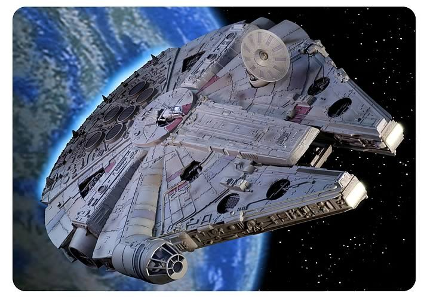
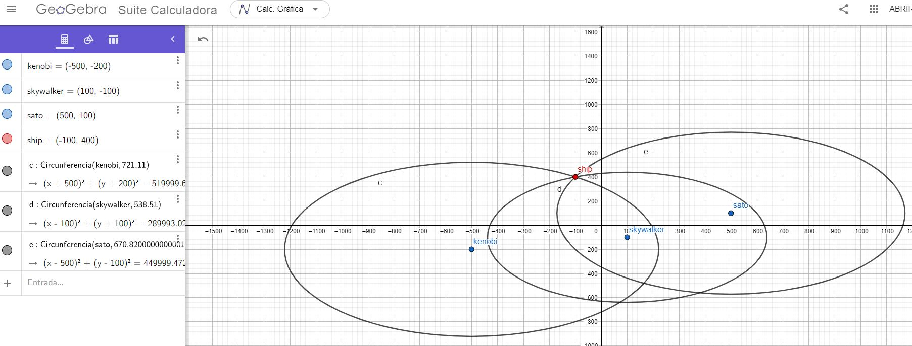
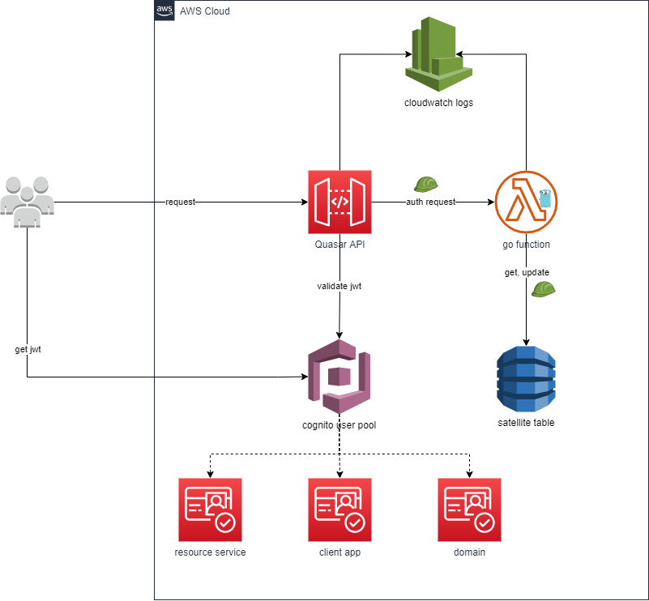
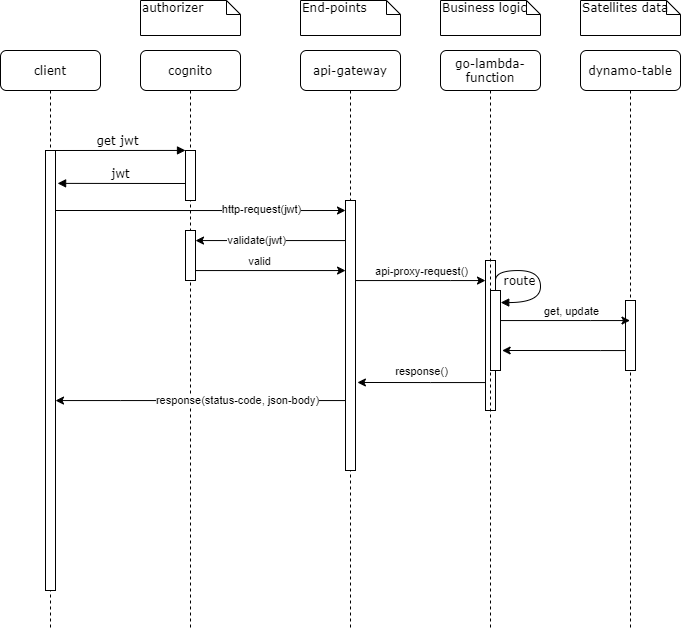

# Meli Quasar Challenge
## Operación Fuego de Quasar
Repositorio contenedor de la solución para el challenge propuesto por mercado libre denominado 
[Operación Fuego de Quasar.](https://github.com/bbasstyle/meli/blob/main/doc/backend-operacion-fuego-de-quasar.pdf)

> Han Solo ha sido recientemente nombrado General de l a Alianza
> Rebelde y busca dar un gran golpe contra el Imperio Galáctico para
> reavivar la llama de la resistencia.

> El servicio de i nteligencia rebelde ha detectado un l lamado de auxilio de
> una nave portacarga i mperial a l a deriva en un campo de asteroides. El
> manifiesto de l a nave es ultra clasificado, pero se rumorea que
> transporta raciones y armamento para una legión entera.

_________________
## Análisis del problema
### Problema Base
Obtener la ubicación de un punto desconocido teniendo la ubicación de otros 3 puntos y su distancia hasta el cuarto punto en cuestión. Para resolver este problema, después de mucho buscar por la web terminé estudiando acerca del concepto de trilateración;

*La trilateración es un método matemático para determinar las posiciones relativas de objetos usando la geometría de triángulos de forma análoga la triangulación. A diferencia de esta, que usa medidas de ángulo, la trilateración usa las localizaciones conocidas de dos o más puntos de referencia, y la distancia medida entre el sujeto y cada punto de referencia. Para determinar de forma única y precisa la localización relativa de un punto en un plano bidimensional usando solo trilateración, se necesitan generalmente al menos 3 puntos de referencia.* [ref]( https://amp.blog.buy-es.com/1849965/1/trilateracion.html)

Teniendo claro la forma (fórmula) en que se podía resolver el problema, me puse manos a la obra.
_________________
## Diseño de la solución

### Diagrama de despliegue

### Diagrama de secuencia

_________________
## Ambientación Local

### Prerequisitos Generales
- cuenta activa con privilegios en los servicios aws referenciados en la sección [`Tools Box`](#Tools-Box)
- command line
- git
- aws cli
- go versión >= 1.16
- make command
- editor de texto o "ide"

### Archivo de configuración ambiente local **.env**
`AWS_ACCOUNT_ID=id cuenta aws a utilizar`
`AWS_BUCKET_NAME=nombre del bucket s3 a utilizar para los despliegues`
`AWS_STACK_NAME=nombre del stack`
`AWS_REGION=región donde se instalarán los artefactos`

### Comandos de ayuda
Para simplificar el trabajo en ambiente local se disponibiliza un MakeFile que apoya con la ejecución de comandos;
- **make clean** (limpia directorio dist)
- **make build** (_clean_ + go build)
- **make install** (instala dependencias)
- **configure** (creación del bucket en s3 que contendrá el zip del código a desplegar)
- **make test** (ejecuta pruebas unitarias)
- **make put-satellites-into-db** (inserta los 3 registros correspondiente a los satellites en dynamodb)
- **make package** (_build_ + cloudformation package)
- make test
- make package
- **make deploy** (cloudformation deploy)

## Despliegue

## Tools Box
- golang 1.16
- make
- aws 
    - cli
    - sam
    - lambda
    - api gateway
    - cloudwatch
    - cloudformation
    - s3
    - dynamo
    - cognito
- curl
- postman
- visual studio code
- generador MD https://dillinger.io/
- formateador json http://jsonviewer.stack.hu/

## Documento con el detalle del challenge 

## Versión 

## code
## Autor
- Bastián Bastías Sánchez, Ingeniero en Informática

### Referencias
- https://www.physicsforums.com/threads/how-to-calculate-2d-trilateration-step-by-step.874246/
- https://intellipaat.com/community/14464/2d-trilateration
- https://www.researchgate.net/publication/265336167_A_Novel_Trilateration_Algorithm_for_Localization_of_a_TransmitterReceiver_Station_in_a_2D_Plane_Using_Analytical_Geometry
- https://www.physicsforums.com/threads/2d-trilateration-with-3-sensors.680652/
- https://stackoverflow.com/questions/2813615/trilateration-using-3-latitude-and-longitude-points-and-3-distances
- https://gis.stackexchange.com/questions/66/trilateration-using-3-latitude-longitude-points-and-3-distances
- https://stackoverflow.com/questions/29656921/trilateration-2d-algorithm-implementation
- https://gis.stackexchange.com/questions/40660/trilateration-algorithm-for-n-amount-of-points?newreg=8c203a449c8442a09ac5891e2b72d66e
- https://math.stackexchange.com/questions/884807/find-x-location-using-3-known-x-y-location-using-trilateration
- https://math.stackexchange.com/questions/100448/finding-location-of-a-point-on-2d-plane-given-the-distances-to-three-other-know
- http://es.onlinemschool.com/math/assistance/cartesian_coordinate/p_length/
- https://es.symbolab.com/solver/equation-calculator/

